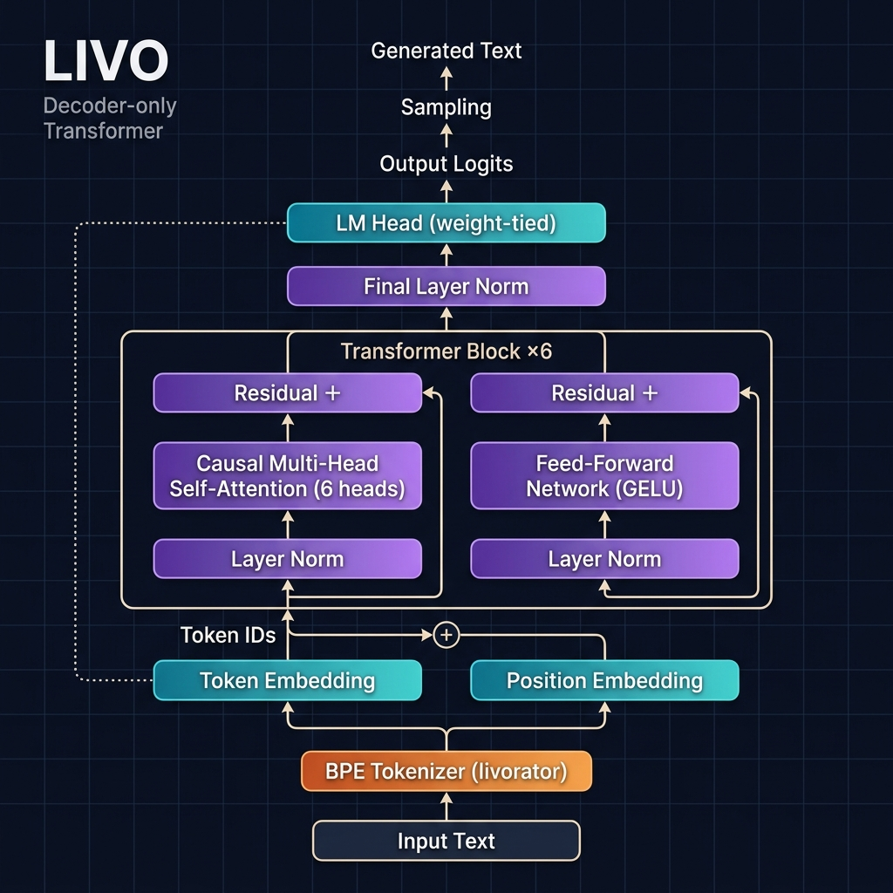

<p align="center">
  <h1 align="center">🧠 LIVO</h1>
  <p align="center"><strong>A from-scratch decoder-only transformer language model built with PyTorch</strong></p>
  <p align="center">Custom trainable BPE tokenizer • ~17M parameters • Train on any dataset</p>
</p>

---

## Overview

**LIVO** is a lightweight causal language model built entirely from scratch in PyTorch — no HuggingFace model classes, no pre-built architectures. Every component (tokenizer, embeddings, attention, training loop) is hand-written for full transparency and learning.

Train it on **any text dataset** — HuggingFace datasets, local text files, or your own data.

### Key Features

- 🔤 **Trainable BPE Tokenizer** (`livorator`) — train on your data, save/load, 16K vocabulary
- 🏗️ **Decoder-Only Transformer** — 6 layers, 6 attention heads, pre-norm architecture
- 📦 **Any Dataset** — HuggingFace Hub, local `.txt` files, or custom data
- ⚡ **Training Optimizations** — mixed precision (FP16), gradient accumulation, gradient checkpointing
- 💾 **Checkpoint System** — save/resume training, fine-tuning mode support
- 🔗 **Weight Tying** — input embeddings shared with output projection

---

## Architecture

<p align="center">
  
</p>

### Model Specifications

| Component | Details |
|---|---|
| **Architecture** | Decoder-only Transformer (GPT-style) |
| **Parameters** | ~17.1M |
| **Vocabulary** | 16,384 tokens (BPE) |
| **Context Length** | 512 tokens |
| **Model Dimension** | 384 |
| **Layers** | 6 |
| **Attention Heads** | 6 (head dim = 64) |
| **FFN Hidden Dim** | 1,536 (4× d_model) |
| **Activation** | GELU |
| **Normalization** | Pre-LayerNorm |
| **Position Encoding** | Learned |
| **Dropout** | 0.1 |

### Data Flow

```
Input Text
    │
    ▼
┌─────────────────────────┐
│   livorator (BPE)       │  Trainable byte-pair encoding
│   vocab_size: 16,384    │  train() → save() → load()
└──────────┬──────────────┘
           │
           ▼
┌──────────────────┐   ┌──────────────────────┐
│ Token Embedding  │ + │ Position Embedding   │
│ (16384 × 384)    │   │ (512 × 384)          │
└──────────┬───────┘   └──────────┬────────────┘
           └──────────┬───────────┘
                      │
           ┌──────────▼───────────┐
           │  Transformer Block   │ ×6
           │  ┌────────────────┐  │
           │  │ LayerNorm      │  │
           │  │ Causal MHA     │  │  6 heads, masked
           │  │ Residual +     │  │
           │  │ LayerNorm      │  │
           │  │ FFN (GELU)     │  │  384 → 1536 → 384
           │  │ Residual +     │  │
           │  └────────────────┘  │
           └──────────┬───────────┘
                      │
           ┌──────────▼───────────┐
           │   Final LayerNorm    │
           └──────────┬───────────┘
                      │
           ┌──────────▼───────────┐
           │   LM Head (Linear)   │  Weight-tied
           └──────────┬───────────┘
                      │
              Output Logits
          (sampling → text)
```

---

## Project Structure

```
LIVO/
├── configs/
│   ├── model.yml            # Model hyperparameters
│   ├── train.yml            # Training hyperparameters
│   └── tokenizer.json       # Trained tokenizer (after training)
├── data/
│   ├── tokenizer.py         # livorator — trainable BPE tokenizer
│   ├── dataset.py           # Generic dataset loader (any source)
│   └── collator.py          # Batch collation for training
├── model/
│   ├── embeddings.py        # Token + Positional embeddings
│   ├── transformer_block.py # Pre-norm transformer with causal attention
│   └── llm.py               # Full LLM model assembly
├── training/
│   ├── loss.py              # Causal LM loss + perplexity
│   └── trainer.py           # Training loop with mixed precision
├── scripts/
│   ├── train_tokenizer.py   # Train BPE tokenizer on any data
│   ├── train.py             # Model training entry point
│   └── generate.py          # Text generation / inference
├── utils/
│   ├── device.py            # Device/runtime utilities
│   └── logger.py            # Logging setup
├── docs/
│   ├── architecture.png     # Architecture diagram
│   └── ARCHITECTURE.md      # Technical deep dive
└── requirements.txt         # Dependencies
```

---

## Quick Start

### 1. Install Dependencies

```bash
python -m venv .venv
.venv\Scripts\activate        # Windows
# source .venv/bin/activate   # Linux/Mac

pip install -r requirements.txt
```

### 2. Train the Tokenizer (Optional but Recommended)

Train a tokenizer on your target dataset for better compression:

```bash
# On TinyStories (default)
python scripts/train_tokenizer.py

# On any HuggingFace dataset
python scripts/train_tokenizer.py --dataset wikitext --config wikitext-2-raw-v1

# On local text files
python scripts/train_tokenizer.py --local-dir ./my_texts/

# Custom vocab size
python scripts/train_tokenizer.py --vocab-size 8192 --num-samples 50000
```

This saves `configs/tokenizer.json`. Skip this step to use default merges.

### 3. Train the Model

```bash
# Default: TinyStories with default tokenizer
python scripts/train.py

# With trained tokenizer
python scripts/train.py --tokenizer configs/tokenizer.json

# Any HuggingFace dataset
python scripts/train.py --dataset wikitext --dataset-config wikitext-2-raw-v1

# Local text files
python scripts/train.py --dataset ./my_texts/ --local

# Quick test (1000 samples, 50 steps)
python scripts/train.py --max-samples 1000 --max-steps 50
```

### 4. Generate Text

```bash
python scripts/generate.py \
  --checkpoint checkpoints/latest.pt \
  --prompt "Once upon a time" \
  --max-new-tokens 100 \
  --temperature 0.8
```

---

## Supported Datasets

LIVO works with **any text dataset**:

| Source | Example | Command |
|---|---|---|
| HuggingFace | TinyStories | `--dataset roneneldan/TinyStories` |
| HuggingFace | WikiText | `--dataset wikitext --dataset-config wikitext-2-raw-v1` |
| HuggingFace | OpenWebText | `--dataset openwebtext` |
| HuggingFace | BookCorpus | `--dataset bookcorpus` |
| Local files | Your `.txt` files | `--dataset ./my_data/ --local` |

For datasets with non-standard column names, use `--text-column <name>`.

---

## The Tokenizer: livorator

A custom **trainable** byte-level BPE tokenizer.

```python
from data.tokenizer import livorator

# 1. Create and train on your data
tok = livorator(vocab_size=16384)
tok.train(["your texts here...", "more text..."])

# 2. Save for reuse
tok.save("tokenizer.json")

# 3. Load later
tok = livorator.load("tokenizer.json")

# 4. Encode / Decode
tokens = tok.encode("Hello, World!")    # [2, 76, 300, ...]
text = tok.decode(tokens)               # "Hello, World!"
```

| Feature | Details |
|---|---|
| Algorithm | Byte-Pair Encoding (BPE) |
| Base vocabulary | 256 bytes + 4 special tokens |
| Trainable merges | Up to 16,124 learned from data |
| Special tokens | `<pad>=0`, `<unk>=1`, `<bos>=2`, `<eos>=3` |
| Persistence | Save/load via JSON |
| Default mode | Works without training (seed-based merges) |

---

## Training Configuration

### Model Config (`configs/model.yml`)
```yaml
model:
  vocab_size: 16384
  max_length: 512
  d_model: 384
  num_layers: 6
  num_heads: 6
  ffn_dim: 1536
  dropout: 0.1
```

### Training Config (`configs/train.yml`)
```yaml
seed: 42
precision: fp16
batch_size: 2
grad_accum_steps: 4          # Effective batch = 8
learning_rate: 0.0002
warmup_steps: 1000
max_steps: 10000
grad_clip_norm: 1.0
```

---

## Hardware Requirements

| Setup | Notes |
|---|---|
| **Minimum** | 8GB RAM, any modern CPU (slow but works) |
| **Recommended** | NVIDIA GPU with 4GB+ VRAM (RTX 3050+) |
| **Optimal** | NVIDIA GPU with 6GB+ VRAM, CUDA 12.1 |

---

## License

This project is for educational and research purposes.

---

<p align="center">
  <strong>Built from scratch with 🧠 and PyTorch</strong>
</p>
